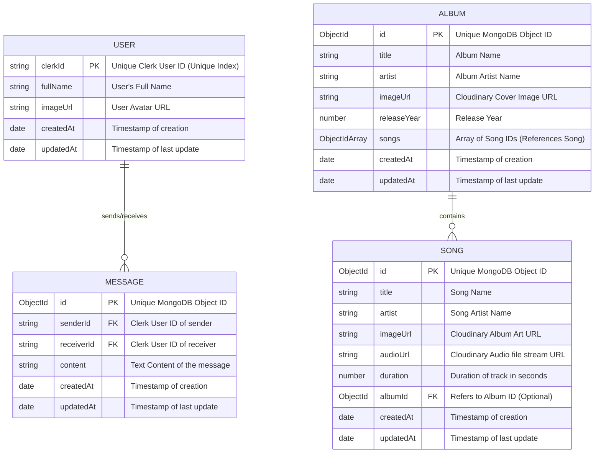
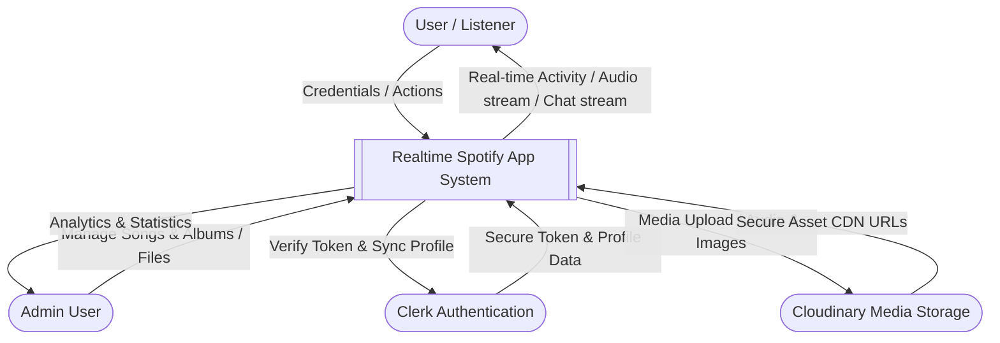
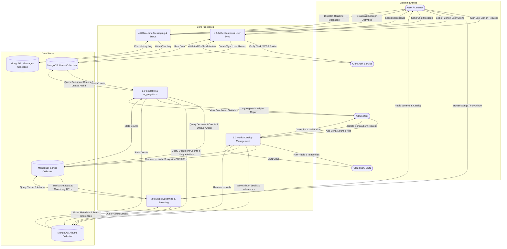

# Realtime Spotify Application ✨

This repository contains a full-stack, production-ready **Realtime Spotify Clone** designed as a final year college project. It features music streaming, an admin panel for content management, user-to-user chatting, real-time presence indicators, and advanced data aggregation analytics.

Below you will find the complete system design resources, including the **Entity-Relationship Diagram (ERD)** and the **Data Flow Diagrams (DFD)** (Context Level 0 and Process Level 1) to assist in your project documentation, reports, and diagrams.

---

## 📸 Demo Preview


---

## 🛠️ Tech Stack & System Architecture

The application is built using a modern **MERN** architecture coupled with real-time WebSockets:

*   **Frontend**: React (Vite), TailwindCSS, Shadcn UI, Zustand (State Management), Lucide Icons, React Router DOM, Socket.io-client.
*   **Backend**: Node.js, Express.js, REST API, Socket.io (WebSockets for real-time status and chat), Node-Cron (temporary file clean-up).
*   **Database**: MongoDB (NoSQL) with Mongoose Object Modeling.
*   **Authentication & Session Management**: Clerk (OAuth 2.0, Secure Login, Session Sync).
*   **Cloud Media Hosting**: Cloudinary (for storing and streaming audio files and images).

---

## 📊 Entity-Relationship Diagram (ERD)

The database is built on MongoDB using Mongoose. The diagram below illustrates the collections, fields, data types, and relationships (using Mermaid syntax).



### Schema & Entity Details

1.  **User Entity (`User`)**:
    *   `clerkId`: Primary Identifier synced from Clerk Authentication.
    *   `fullName`: Full name of the user.
    *   `imageUrl`: Link to the user profile avatar.
2.  **Song Entity (`Song`)**:
    *   `title` & `artist`: Song details.
    *   `imageUrl` & `audioUrl`: Media stream URLs hosted securely on Cloudinary.
    *   `duration`: Duration of the song in seconds.
    *   `albumId`: Optional Foreign Key pointing to the `Album` entity.
3.  **Album Entity (`Album`)**:
    *   `title` & `artist`: Album details.
    *   `imageUrl`: Album art hosted on Cloudinary.
    *   `releaseYear`: Release year of the album.
    *   `songs`: Array of ObjectIds representing the songs assigned to this album.
4.  **Message Entity (`Message`)**:
    *   `senderId` & `receiverId`: References to the Clerk ID of the sender and receiver.
    *   `content`: The text content of the message.

---

## 🔄 Data Flow Diagrams (DFD)

The following diagrams show how data propagates through the system, from external entities (User, Admin, Clerk, Cloudinary) to the internal database and real-time processes.

### DFD Level 0: Context Diagram
This diagram represents the boundary of the system, showing the inputs and outputs between the System and the External Entities.



---

### DFD Level 1: Detailed Process Flow Diagram
This diagram decomposes the system into major functional components, showcasing the specific data stores (MongoDB collections) and interactions.



---

## 🚀 Installation & Setup

Follow these steps to set up and run the project locally.

### Prerequisites
*   Node.js (v18+)
*   MongoDB Atlas Account
*   Clerk Account (for authentication)
*   Cloudinary Account (for media uploads)

### 1. Setup Environment Variables

Create a `.env` file in the **`backend`** folder:
```env
PORT=5000
MONGODB_URI=your_mongodb_connection_string
ADMIN_EMAIL=your_admin_email_registered_on_clerk
NODE_ENV=development

CLOUDINARY_API_KEY=your_cloudinary_api_key
CLOUDINARY_API_SECRET=your_cloudinary_api_secret
CLOUDINARY_CLOUD_NAME=your_cloudinary_cloud_name

CLERK_PUBLISHABLE_KEY=your_clerk_publishable_key
CLERK_SECRET_KEY=your_clerk_secret_key
```

Create a `.env` file in the **`frontend`** folder:
```env
VITE_CLERK_PUBLISHABLE_KEY=your_clerk_publishable_key
```

### 2. Run the Application

#### Automated Scripts
You can install and build both client and server from the root directory:
```bash
# Install all dependencies and build frontend
npm run build

# Start the backend server
npm start
```

#### Running in Development Mode
To run client and server independently:

**Start Backend server:**
```bash
cd backend
npm install
npm run dev
```

**Start Frontend client:**
```bash
cd frontend
npm install
npm run dev
```
The frontend will run at `http://localhost:3000` (or `http://localhost:5173` depending on ports configured).

---

## 📈 Key API Endpoints Reference

*   **Auth Routes** (`/api/auth`)
    *   `POST /callback`: Handles new user signup/login syncing with clerk details.
*   **User Routes** (`/api/users`)
    *   `GET /`: Fetches all registered users (excluding current active user).
    *   `GET /messages/:userId`: Fetches chat logs between current user and requested user.
*   **Admin Routes** (`/api/admin`) *(Requires admin email authorization)*
    *   `GET /check`: Verifies admin status.
    *   `POST /songs`: Uploads and publishes a song to Cloudinary and MongoDB.
    *   `DELETE /songs/:id`: Deletes song record and database relationship.
    *   `POST /albums`: Creates a new music album.
    *   `DELETE /albums/:id`: Deletes album and dependencies.
*   **Song Routes** (`/api/songs`)
    *   `GET /featured`: Gets curated tracks list.
    *   `GET /made-for-you`: Gets customized recommendations.
    *   `GET /trending`: Gets trending tracks list.
*   **Album Routes** (`/api/albums`)
    *   `GET /`: Gets all albums.
    *   `GET /:albumId`: Gets specific album details and associated song items.
*   **Stat Routes** (`/api/stats`) *(Admin only)*
    *   `GET /`: Returns total count of songs, albums, users, and unique artists.
